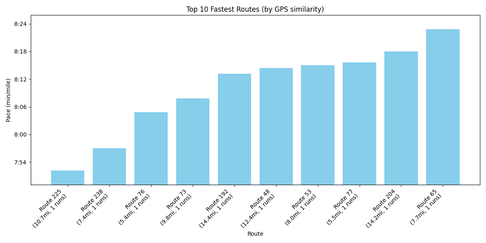
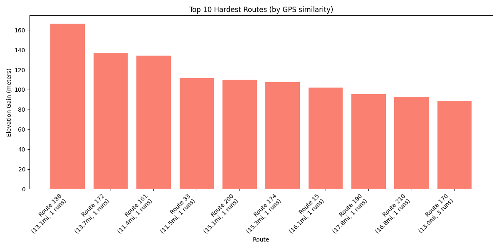
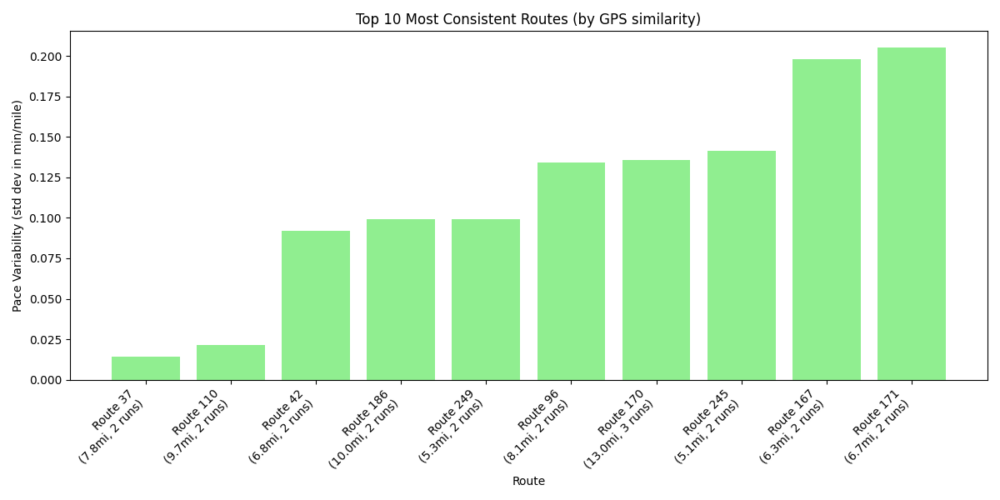

# Recognizing Patterns in Strava Running Routes

## Introduction

This project aims to answer the question: which of my running routes am I usually the fastest on, which are the hardest, and which is my pace most consistent? I decided to do this research because I run competitively, so I run often and it is important for me to know how my runs and routes will affect me. The results of the research will help me notice patterns in the routes that I choose and how they affect other parts of my training, such as my pace.  

## Datasets

I used data from my own Strava page to get the data from my runs. Strava is an app where I upload all my runs and can see data such as distance, pace, time, and GPS of where the run took place.  

- **activities.csv**: Contains data such as distance, pace, time, and elevation for each run.  
- **GPX files**: Contains GPS data to see where the routes took place.  

## Methods

1. Loaded all the Strava data from `activities.csv` and GPX files and cleaned it to only include the columns needed, such as pace, moving time, elevation, and others.  
2. Created **route clusters**, which group similar routes together so the data is smoother.  
3. Created a **route centroid** to translate numeric route clusters into descriptive titles. The centroid uses coordinate points and retrieves a general location name from Google Maps. This is saved into a text file.  
4. Plotted data on three separate graphs:  
   - Routes with the fastest paces  
   - Routes that were the hardest  
   - Routes with the most consistent pace  

## Results

- **Fastest routes**: Determined by the fastest average pace during a run.
    
- **Hardest routes**: Determined by the highest elevation gain.
     
- **Most consistent routes**: Determined by the lowest standard deviation of speed.
     

## Discussion

This research was helpful to me, because now I can look at the routes I run and see how they are affecting my training. I can look at the routes on my hardest graph, and it can explain why I may feel more tired the next day after one of those runs. This research could lead into further discovery of what parts of the route, such as terrain or elevation, could make it have a typically fast pace. This could help discover a runner's strengths and weaknesses and make training decisions, such as knowing which hard routes to avoid before big performances.  
